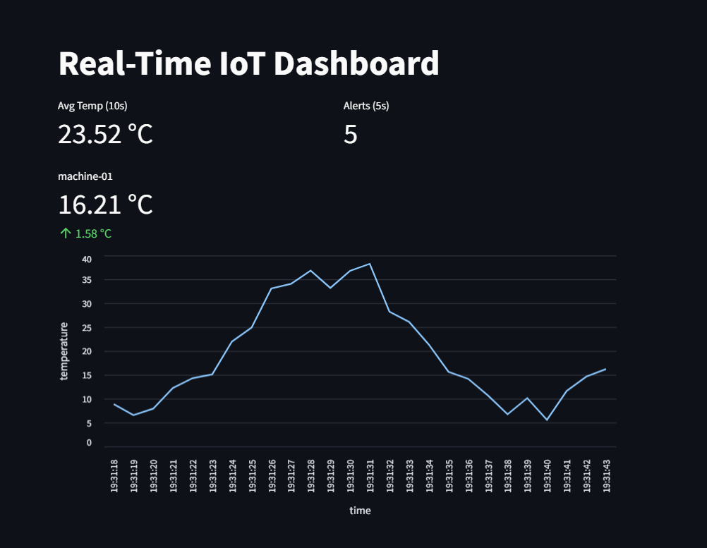

# Real-Time Kafka KPI Dashboard

This project uses Kafka, Quix Streams, and Streamlit to show real-time KPIs from sensor data.

## KPIs

- **Temperature of machine**:
  Shows the current temperature of machine-01.

- **Average Temperature (10s)**:  
  Shows the average temperature over a rolling 10-second window of machine-01.
  
- **Alert Count (5s)**:  
  Shows how many alert messages were received in the last 5 seconds.

## Dashboard Screenshot

